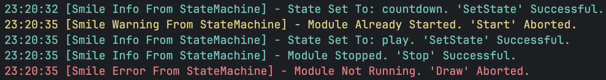

# Developer Setup ⌨️

## Thank you for your interest in contributing to Smile!

This series of documents in the `_Contributing` directory will guide you through
everything you need to know to work effectively within the project.

The document you’re reading introduces Smile’s Developer Mode and helps you set
up your environment to start contributing.

In addition, the other files each focus on a specific aspect of Smile’s
development workflow:

- [1_Understanding_Smile](../1_Understanding_Smile)
    - [Structure](../1_Understanding_Smile/Structure.md)
- [2_Coding_Guidelines](../2_Coding_Guidelines)
    - [Code_Organization](../2_Coding_Guidelines/Code_Organization.md)
    - [Code_Style](../2_Coding_Guidelines/Code_Style.md)
- 3_Documentation_Guidelines (🚧 Under Development)
- 4_Testing_Guidelines (🚧 Under Development)
- 5_Pull_Requesting (🚧 Under Development)
- 6_Issues_And_Suggestions (🚧 Under Development)

---

<br>

## Table of Contents

- [Differences Between DEV and USER Modes](#-differences-between-dev-and-user-modes)
- [Building Smile In Developer Mode](#-building-smile-in-developer-mode)
- [Up Next](#-up-next)

---

<br>

## ⚖️ Differences Between DEV And USER Modes

By default, Smile builds in User Mode, optimized for performance and minimal
build size. It excludes development tools and test files, focusing on delivering
the final library or application.

Developer Mode, on the other hand, is intended for contributors. It enables
extra build steps, includes internal tests, and provides additional output
during configuration to help with debugging and development.

---

<br>

## 🚀 Building Smile in Developer Mode

### Prerequisites

Before building Smile, make sure you have the following installed:

- **CMake** 3.30 or higher
- A CMake-supported build tool such as **Ninja**, **Make**, or **Visual Studio**
- A C compiler such as **Clang** or **GCC**

### Cloning and Building

If you have not yet cloned Smile, run:

```zsh
git clone https://github.com/vitorbetmann/smile.git
cd smile
```

Now you can compile it in Developer Mode:

```zsh
cmake -S . -B build -G Ninja -DSMILE_DEV=ON
cmake --build build
```

If you are using a multi-config generator such as **Visual Studio**, configure
and build Smile like this instead:

```zsh
cmake -S . -B build -DSMILE_DEV=ON
cmake --build build --config Debug
```

Single-config generators choose the build type during configuration. Multi-config
generators choose it during the build step.

During configuration, Smile will report the active build settings, such as:

```zsh
-- Smile — Build type: Debug
-- Smile — Warning logs: ON
-- Smile — Info logs: ON
-- Smile — Build Tests: ON
```

This confirms Smile is built in developer mode.

**Note:**  
By default, Smile compiles with runtime **warning** and **info** logs enabled.
Below is an example of how they would appear in your terminal:



If you want to disable them, pass the following flags when configuring your
build with CMake:

 ```zsh
 cmake -S . -B build -DSMILE_DEV=ON -DSMILE_WARN=OFF -DSMILE_INFO=OFF
 ```

This will disable all Smile **warning** and **info** logging output at build
time. Errors cannot be disabled.

---

<br>

## ➡️ Up Next

Understand the [Structure](../1_Understanding_Smile/Structure.md) of Smile.

